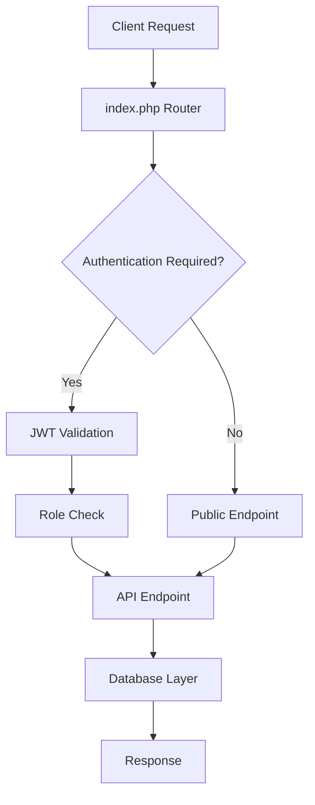

```
██████╗ ██╗   ██╗███╗   ██╗███╗   ██╗██╗ ██████╗
██╔══██╗██║   ██║████╗  ██║████╗  ██║██║██╔═══██╗
██████╔╝██║   ██║██╔██╗ ██║██╔██╗ ██║██║██║   ██║
██╔══██╗██║   ██║██║╚██╗██║██║╚██╗██║██║██║   ██║
██║  ██║╚██████╔╝██║ ╚████║██║ ╚████║██║╚██████╔╝
╚═╝  ╚═╝ ╚═════╝ ╚═╝  ╚═══╝╚═╝  ╚═══╝╚═╝ ╚═════╝
```

<div align="center">

# 🏃‍♂️ **Runnio - Running Events Management System**

### *Empowering runners, organizing events, tracking achievements* 🏆

[](https://php.net)
[](https://reactjs.org)
[](https://mysql.com)
[](LICENSE)

[🚀 Quick Start](#-quick-start) • [📖 Documentation](#-api-documentation) • [🎯 Features](#-features) • [🛠 Tech Stack](#-tech-stack)

</div>

---

## 📋 **Table of Contents**

- [🎯 Features](#-features)
- [🚀 Quick Start](#-quick-start)
- [📊 Demo Accounts](#-demo-accounts)
- [🏗 Project Structure](#-project-structure)
- [🛠 Tech Stack](#-tech-stack)
- [🔐 Security Features](#-security-features)
- [📖 API Documentation](#-api-documentation)
- [🔧 Development](#-development)
- [🐛 Troubleshooting](#-troubleshooting)
- [🤝 Contributing](#-contributing)
- [📄 License](#-license)

---

## 🎯 **Features**

<table>
<tr>
<td width="33%">

### 🌐 **Public Access**
- 🔍 Browse events without registration
- 🎛️ Advanced filtering & search
- 📱 Responsive design
- 📊 Real-time event statistics

</td>
<td width="33%">

### 👤 **User Portal**
- 🔐 Secure authentication
- 📝 Easy event registration
- 📈 Personal dashboard
- 🏃‍♂️ Results tracking

</td>
<td width="33%">

### 👨‍💼 **Admin Control**
- ⚙️ Complete event management
- 👥 User oversight
- 📊 Analytics dashboard
- 🎛️ System configuration

</td>
</tr>
</table>

### 🌟 **Key Capabilities**

| Feature | Description | User Type |
|---------|-------------|-----------|
| 🏃‍♂️ **Event Discovery** | Browse and filter running events by type, location, date, and distance | Public |
| 📝 **Quick Registration** | One-click event registration with distance selection | Users |
| 📊 **Results Tracking** | Submit and track race results with pace, time, and notes | Users |
| 🎛️ **Event Management** | Create, edit, and manage events with flexible metadata | Admins |
| 👥 **User Oversight** | Monitor registrations and manage user accounts | Admins |
| 📈 **Analytics** | Comprehensive dashboards with statistics and insights | Admins |

---

## 🚀 **Quick Start**

### 📋 **Prerequisites**

Before you begin, ensure you have the following installed:

| Requirement | Version | Download |
|-------------|---------|----------|
| 🐘 **PHP** | 7.4+ | [Download PHP](https://php.net/downloads) |
| 🗄️ **MySQL** | 5.7+ | [Download MySQL](https://dev.mysql.com/downloads/) |
| 🟢 **Node.js** | 16+ | [Download Node.js](https://nodejs.org/) |
| 📦 **npm/yarn** | Latest | Included with Node.js |

### ⚡ **Installation**

<details>
<summary><b>🗄️ Step 1: Database Setup</b></summary>

```bash
# 1. Create database
mysql -u root -p
CREATE DATABASE running_events;
CREATE USER 'running_user'@'localhost' IDENTIFIED BY 'your_password';
GRANT ALL PRIVILEGES ON running_events.* TO 'running_user'@'localhost';
FLUSH PRIVILEGES;
EXIT;

# 2. Test backend setup
php test_backend.php

# 3. Run database migrations
cd backend && php database/setup.php
```

</details>

<details>
<summary><b>⚙️ Step 2: Backend Configuration</b></summary>

```bash
# 1. Navigate to backend directory
cd backend

# 2. Copy environment file
cp .env.example .env

# 3. Edit .env with your credentials
nano .env  # or use your preferred editor

# 4. Start backend server
php -S localhost:8000
```

**Environment Configuration:**
```env
DB_HOST=localhost
DB_NAME=running_events
DB_USER=running_user
DB_PASS=your_password
JWT_SECRET=your-very-secure-secret-key
```

</details>

<details>
<summary><b>🎨 Step 3: Frontend Setup</b></summary>

```bash
# 1. Navigate to frontend directory
cd frontend

# 2. Install dependencies
npm install

# 3. Start development server
npm run dev

# 4. Open browser
# Frontend will be available at http://localhost:3000
```

</details>

### 🎯 **Verification**

After setup, verify everything works:

1. ✅ **Backend API**: Visit `http://localhost:8000/api/events`
2. ✅ **Frontend**: Visit `http://localhost:3000`
3. ✅ **Login**: Use demo accounts below

---

## 📊 **Demo Accounts**

<div align="center">

| Role | Email | Password | Capabilities |
|------|-------|----------|--------------|
| 👨‍💼 **Admin** | `admin@runningevents.com` | `admin123` | Full system access |
| 👤 **User** | `john@example.com` | `user123` | Event registration & results |

</div>

> 🔒 **Security Note**: Change these credentials in production!

---

## 🏗 **Project Structure**

```
🏃‍♂️ runnio/
├── 📁 backend/                    # 🐘 PHP Backend API
│   ├── 📁 api/                   # 🔌 RESTful Endpoints
│   │   ├── 📁 auth/             # 🔐 Authentication (login/register)
│   │   ├── 📁 events/           # 🏃‍♂️ Event management (CRUD)
│   │   ├── 📁 registrations/    # 📝 Registration handling
│   │   └── 📁 logs/             # 📊 Race results & logs
│   ├── 📁 config/               # ⚙️ Configuration files
│   ├── 📁 database/             # 🗄️ Migrations & setup
│   │   └── 📁 migrations/       # 📋 SQL migration files
│   └── 📁 utils/                # 🛠️ Utility classes (JWT, Auth, etc.)
├── 📁 frontend/                   # ⚛️ React Frontend
│   ├── 📁 src/
│   │   ├── 📁 components/       # 🧩 Reusable UI components
│   │   ├── 📁 contexts/         # 🌐 React contexts (Auth)
│   │   ├── 📁 pages/            # 📄 Page components
│   │   └── 📁 utils/            # 🔧 Helper functions
│   ├── 📄 package.json          # 📦 Dependencies
│   └── 📄 vite.config.js        # ⚡ Vite configuration
├── 📄 readme.md                  # 📖 This file
├── 📄 setup.md                   # 🚀 Detailed setup guide
└── 📄 test_backend.php           # 🧪 Backend testing script
```

---

## 🛠 **Tech Stack**

<div align="center">

### 🔧 **Backend Technologies**
[](https://php.net)
[](https://mysql.com)
[](https://jwt.io)

### 🎨 **Frontend Technologies**
[](https://reactjs.org)
[](https://vitejs.dev)
[](https://axios-http.com)

### 🎯 **Key Features**
[](https://developer.mozilla.org/en-US/docs/Learn/CSS/CSS_layout/Responsive_Design)
[](https://restfulapi.net)
[](https://auth0.com/intro-to-iam/what-is-role-based-access-control-rbac)

</div>

| Component | Technology | Purpose |
|-----------|------------|---------|
| 🗄️ **Database** | MySQL 5.7+ | Data persistence with optimized indexes |
| 🔙 **Backend** | PHP 7.4+ | RESTful API with JWT authentication |
| 🎨 **Frontend** | React 18 | Modern SPA with hooks and context |
| 🔧 **Build Tool** | Vite | Fast development and optimized builds |
| 🔐 **Authentication** | JWT + RBAC | Secure token-based auth with roles |
| 🎨 **Styling** | Custom CSS3 | Responsive design with modern layouts |

---

## 📖 **API Documentation**

<div align="center">

### 🔌 **RESTful API Endpoints**

*Complete API reference for developers and integrators*

</div>

<details>
<summary><b>🔐 Authentication Endpoints</b></summary>

| Method | Endpoint | Description | Access |
|--------|----------|-------------|--------|
| `POST` | `/api/register` | User registration | Public |
| `POST` | `/api/login` | User authentication | Public |

**Example Request:**
```json
POST /api/login
{
  "email": "user@example.com",
  "password": "password123"
}
```

**Example Response:**
```json
{
  "success": true,
  "message": "Login successful",
  "data": {
    "user": {
      "id": 1,
      "name": "John Doe",
      "email": "user@example.com",
      "role": "user"
    },
    "token": "eyJ0eXAiOiJKV1QiLCJhbGciOiJIUzI1NiJ9..."
  }
}
```

</details>

<details>
<summary><b>🏃‍♂️ Events Endpoints</b></summary>

| Method | Endpoint | Description | Access |
|--------|----------|-------------|--------|
| `GET` | `/api/events` | List all events | Public |
| `GET` | `/api/events/:id` | Get event details | Public |
| `POST` | `/api/events` | Create new event | Admin |
| `PUT` | `/api/events/:id` | Update event | Admin |
| `DELETE` | `/api/events/:id` | Delete event | Admin |

**Query Parameters for GET /api/events:**
- `type`: Filter by event type (virtual/onsite)
- `location`: Filter by location
- `search`: Search in name/description
- `date_from`: Filter events from date
- `date_to`: Filter events to date
- `page`: Pagination page number
- `limit`: Results per page

</details>

<details>
<summary><b>📝 Registration Endpoints</b></summary>

| Method | Endpoint | Description | Access |
|--------|----------|-------------|--------|
| `POST` | `/api/events/:id/register` | Register for event | User |
| `GET` | `/api/users/:id/registrations` | Get user registrations | User/Admin |
| `GET` | `/api/registrations` | Get all registrations | Admin |

</details>

<details>
<summary><b>📊 User Logs Endpoints</b></summary>

| Method | Endpoint | Description | Access |
|--------|----------|-------------|--------|
| `GET` | `/api/registrations/:id/logs` | Get registration logs | User/Admin |
| `POST` | `/api/registrations/:id/logs` | Submit race results | User/Admin |

</details>

🗄 Database Schema
1. users
CREATE TABLE users (
    id INT AUTO_INCREMENT PRIMARY KEY,
    name VARCHAR(255) NOT NULL,
    email VARCHAR(255) UNIQUE NOT NULL,
    password VARCHAR(255) NOT NULL,  -- hashed
    role ENUM('admin', 'user') DEFAULT 'user',
    created_at TIMESTAMP DEFAULT CURRENT_TIMESTAMP
);

2. events
CREATE TABLE events (
    id INT AUTO_INCREMENT PRIMARY KEY,
    name VARCHAR(255) NOT NULL,
    description TEXT,
    type ENUM('virtual', 'onsite') NOT NULL,
    location VARCHAR(255) DEFAULT NULL,
    distances VARCHAR(255),
    created_at TIMESTAMP DEFAULT CURRENT_TIMESTAMP,
    registration_deadline DATE,
    submission_deadline DATE
);

3. event_meta
CREATE TABLE event_meta (
    id INT AUTO_INCREMENT PRIMARY KEY,
    event_id INT NOT NULL,
    meta_key VARCHAR(100),
    meta_value TEXT,
    FOREIGN KEY (event_id) REFERENCES events(id) ON DELETE CASCADE
);

4. registrations
CREATE TABLE registrations (
    id INT AUTO_INCREMENT PRIMARY KEY,
    user_id INT NOT NULL,
    event_id INT NOT NULL,
    registered_at TIMESTAMP DEFAULT CURRENT_TIMESTAMP,
    FOREIGN KEY (user_id) REFERENCES users(id) ON DELETE CASCADE,
    FOREIGN KEY (event_id) REFERENCES events(id) ON DELETE CASCADE
);

5. user_logs
CREATE TABLE user_logs (
    id INT AUTO_INCREMENT PRIMARY KEY,
    registration_id INT NOT NULL,
    pace VARCHAR(50),
    finish_time VARCHAR(50),
    created_at TIMESTAMP DEFAULT CURRENT_TIMESTAMP,
    FOREIGN KEY (registration_id) REFERENCES registrations(id) ON DELETE CASCADE
);

⚙️ API Endpoints
Authentication
Endpoint	Method	Role	Description
/api/register	POST	All	Register new user
/api/login	POST	All	User login (JWT/session)
Events
Endpoint	Method	Role	Description
/api/events	GET	Public	List all events
/api/events/:id	GET	Public	Get event details
/api/events	POST	Admin	Create event
/api/events/:id	PUT	Admin	Update event
/api/events/:id	DELETE	Admin	Delete event
Registrations
Endpoint	Method	Role	Description
/api/events/:id/register	POST	User	Register for an event
/api/users/:id/registrations	GET	User	Get own registrations
/api/registrations	GET	Admin	Get all registrations
User Logs
Endpoint	Method	Role	Description
/api/registrations/:id/logs	GET	User/Admin	Get logs (own for user, all for admin)
/api/registrations/:id/logs	POST	User/Admin	Add log (own for user, all for admin)
🔒 Role-Based Access Control

Admin

Full control of events (create, edit, delete)

View/manage all registrations

View/manage all logs

User

Browse events

Register for events

Manage only their own registrations & logs

🎨 Frontend Pages

Home Page – Browse all events (public)

Event Details Page – Event info + register

User Dashboard – Own registrations & logs

Admin Dashboard – Manage events, registrations, logs


---

## 🔐 **Security Features**

<div align="center">

| 🛡️ Security Layer | Implementation | Benefit |
|-------------------|----------------|---------|
| 🔑 **Authentication** | JWT tokens with expiration | Stateless, secure sessions |
| 👥 **Authorization** | Role-based access control | Granular permissions |
| 🔒 **Password Security** | PHP password_hash() + salt | Industry-standard hashing |
| 🛡️ **Input Validation** | Server-side sanitization | Prevents XSS/injection |
| 🌐 **CORS Protection** | Configured origins | Prevents unauthorized access |
| 🗄️ **SQL Security** | Prepared statements | Prevents SQL injection |

</div>

### 🔒 **Security Checklist**

- ✅ **JWT Authentication**: Secure token-based authentication
- ✅ **Role-Based Access**: Admin/User permission levels
- ✅ **Password Hashing**: Bcrypt with salt for password security
- ✅ **Input Sanitization**: All user inputs validated and sanitized
- ✅ **CORS Configuration**: Restricted cross-origin requests
- ✅ **SQL Injection Prevention**: Prepared statements throughout
- ✅ **XSS Protection**: Output escaping and CSP headers
- ✅ **Environment Variables**: Sensitive data in .env files

---

## 🎯 **User Experience**

<table>
<tr>
<td width="50%">

### 📱 **Responsive Design**
- 🖥️ Desktop optimized layouts
- 📱 Mobile-first approach
- 📊 Adaptive components
- 🎨 Consistent styling

</td>
<td width="50%">

### ⚡ **Performance**
- 🚀 Fast loading times
- 📦 Optimized bundles
- 🔄 Efficient API calls
- 💾 Smart caching

</td>
</tr>
<tr>
<td width="50%">

### 🧭 **Navigation**
- 🎯 Intuitive menu structure
- 🍞 Breadcrumb navigation
- 🔍 Advanced search & filters
- 📊 Real-time feedback

</td>
<td width="50%">

### 🎛️ **Dashboards**
- 👤 Personalized user views
- 👨‍💼 Comprehensive admin panel
- 📈 Statistics and analytics
- 🎨 Clean, modern interface

</td>
</tr>
</table>

## 📊 Event Management

### Event Types
- **Virtual Events:** Run anywhere, submit results online
- **On-site Events:** Physical location-based races

### Event Features
- Multiple distance options per event
- Registration deadlines and participant limits
- Entry fees and difficulty levels
- Flexible metadata system for custom properties
- Registration tracking and management

## 🏃‍♂️ Registration & Results

- **Easy Registration:** Select distance and register with one click
- **Result Submission:** Track pace, finish time, and personal notes
- **History Tracking:** View all past participations and achievements
- **Status Management:** Track registration status (registered/completed/cancelled)

## 🔧 Development

### Backend Architecture
- **RESTful API:** Clean, consistent endpoint structure
- **Modular Design:** Separated concerns with utility classes
- **Database Abstraction:** PDO for secure database operations
- **Error Handling:** Comprehensive error responses

### Frontend Architecture
- **Component-Based:** Reusable React components
- **Context API:** Global state management for authentication
- **Custom Hooks:** Shared logic for API calls and state
- **Responsive Design:** Mobile-first CSS approach

## 📈 Future Enhancements

- Payment integration for event fees
- Email notifications for registrations and deadlines
- Social features (event sharing, participant networking)
- Advanced analytics and reporting
- Mobile app development
- Integration with fitness tracking devices

---

## 🚀 Tech Stack

---

## 🔧 **Development**

### 🏗️ **Backend Architecture**



### ⚛️ **Frontend Architecture**

- **Component-Based**: Modular, reusable React components
- **Context API**: Global state management for authentication
- **Custom Hooks**: Shared logic for API calls and state management
- **Responsive Design**: Mobile-first CSS approach with flexbox/grid

### 🗄️ **Database Schema**

| Table | Purpose | Key Relationships |
|-------|---------|-------------------|
| `users` | User accounts & authentication | → `registrations`, `events` |
| `events` | Event information & metadata | → `registrations`, `event_meta` |
| `event_meta` | Flexible event properties | ← `events` |
| `registrations` | User-event relationships | ← `users`, `events` → `user_logs` |
| `user_logs` | Race results & performance | ← `registrations` |

---

## 🐛 **Troubleshooting**

<details>
<summary><b>🔧 Common Backend Issues</b></summary>

### Database Connection Errors
```bash
# Check MySQL service
sudo systemctl status mysql

# Test connection
mysql -u root -p -e "SELECT 1"

# Verify .env configuration
cat backend/.env
```

### CORS Issues
```php
// Add to backend/config/config.php
define('ALLOWED_ORIGINS', [
    'http://localhost:3000',
    'http://your-domain.com'
]);
```

### JWT Token Problems
```bash
# Clear browser storage
localStorage.clear()

# Check JWT secret in .env
grep JWT_SECRET backend/.env
```

</details>

<details>
<summary><b>🎨 Common Frontend Issues</b></summary>

### API Connection Errors
```bash
# Check backend server
curl http://localhost:8000/api/events

# Verify proxy in vite.config.js
cat frontend/vite.config.js
```

### Build Issues
```bash
# Clear cache and reinstall
rm -rf node_modules package-lock.json
npm install

# Check Node.js version
node --version  # Should be 16+
```

### Development Server Issues
```bash
# Kill existing processes
lsof -ti:3000 | xargs kill -9
lsof -ti:8000 | xargs kill -9

# Restart servers
npm run dev
```

</details>

<details>
<summary><b>🔍 Debug Mode</b></summary>

### Enable Debug Logging
```php
// In backend/.env
APP_ENV=development

// Check logs
tail -f /var/log/apache2/error.log
```

### Browser Developer Tools
- **Network Tab**: Check API requests/responses
- **Console**: Look for JavaScript errors
- **Application Tab**: Inspect localStorage/sessionStorage

</details>

---

## 🤝 **Contributing**

We welcome contributions! Here's how you can help:

### 🚀 **Getting Started**

1. **Fork the repository**
   ```bash
   git clone https://github.com/yourusername/runnio.git
   cd runnio
   ```

2. **Create a feature branch**
   ```bash
   git checkout -b feature/amazing-feature
   ```

3. **Make your changes**
   - Follow existing code style
   - Add tests for new features
   - Update documentation

4. **Test your changes**
   ```bash
   php test_backend.php
   cd frontend && npm test
   ```

5. **Submit a pull request**

### 📋 **Development Guidelines**

- **Code Style**: Follow PSR-12 for PHP, ESLint for JavaScript
- **Commits**: Use conventional commit messages
- **Testing**: Add tests for new features
- **Documentation**: Update README and inline docs

### 🐛 **Reporting Issues**

Found a bug? Please include:
- Steps to reproduce
- Expected vs actual behavior
- Environment details (PHP/Node versions)
- Error messages/logs

---

## 📈 **Roadmap**

### 🎯 **Upcoming Features**

- [ ] 💳 **Payment Integration** - Stripe/PayPal for event fees
- [ ] 📧 **Email Notifications** - Registration confirmations & reminders
- [ ] 📱 **Mobile App** - React Native companion app
- [ ] 🏆 **Leaderboards** - Performance rankings and achievements
- [ ] 📊 **Advanced Analytics** - Detailed reporting and insights
- [ ] 🌐 **Multi-language** - Internationalization support
- [ ] 🔗 **Social Features** - Event sharing and participant networking
- [ ] ⌚ **Wearable Integration** - Sync with fitness trackers

### 🎨 **UI/UX Improvements**

- [ ] 🌙 **Dark Mode** - Theme switching capability
- [ ] 🎨 **Custom Themes** - Brandable color schemes
- [ ] 📱 **PWA Support** - Progressive Web App features
- [ ] ♿ **Accessibility** - WCAG 2.1 compliance

---

## 📄 **License**

This project is licensed under the **MIT License** - see the [LICENSE](LICENSE) file for details.

```
MIT License

Copyright (c) 2024 Runnio

Permission is hereby granted, free of charge, to any person obtaining a copy
of this software and associated documentation files (the "Software"), to deal
in the Software without restriction, including without limitation the rights
to use, copy, modify, merge, publish, distribute, sublicense, and/or sell
copies of the Software, and to permit persons to whom the Software is
furnished to do so, subject to the following conditions:

The above copyright notice and this permission notice shall be included in all
copies or substantial portions of the Software.
```

---

## 📞 **Support & Contact**

<div align="center">

### 🤝 **Get Help**

[](https://github.com/yourusername/runnio/issues)
[](setup.md)
[](https://discord.gg/runnio)

### 💬 **Community**

- 🐛 **Bug Reports**: [GitHub Issues](https://github.com/yourusername/runnio/issues)
- 💡 **Feature Requests**: [GitHub Discussions](https://github.com/yourusername/runnio/discussions)
- 📖 **Documentation**: [Setup Guide](setup.md)
- 💬 **Chat**: [Discord Community](https://discord.gg/runnio)

</div>

---

<div align="center">

### 🏃‍♂️ **Made with ❤️ for the Running Community**

**Star ⭐ this repo if you find it helpful!**

[](https://github.com/yourusername/runnio/stargazers)
[](https://github.com/yourusername/runnio/network)

*Happy Running! 🏃‍♀️🏃‍♂️*

</div>